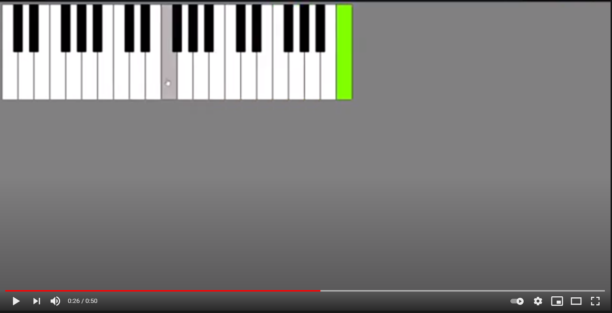

# Musical keyboard 

## Instrumento Teclado desenvolvido com HTML + CSS + JS

<!-- <video width="99%" height="540" autoplay loop controls>
  <source src="https://www.youtube.com/watch?v=SsXUyOl9QXE&ab_channel=Daniloveloso" type="video/mp4" >
</video> -->

Um pequeno exercício para praticar e relembrar conceitos básicos do front. Vida de dev é assim, de vez enquanto devemos voltar e exercitar os fundamentos para não mantermos uma báse firme e sólida.